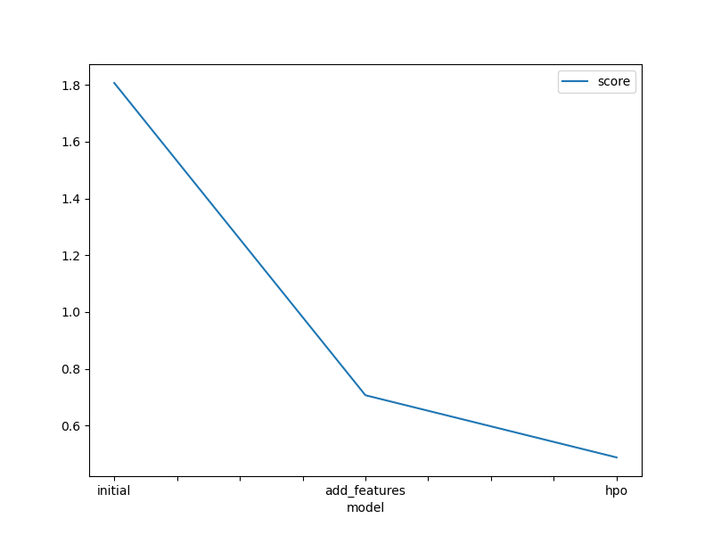
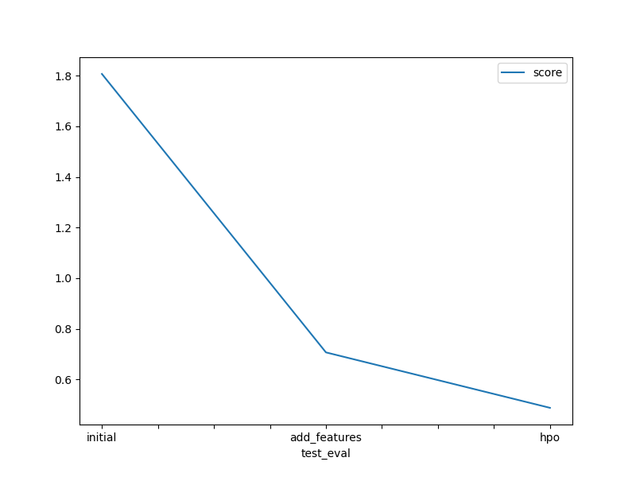

# Report: Predict Bike Sharing Demand with AutoGluon Solution
#### NAME HERE

## Initial Training
### What did you realize when you tried to submit your predictions? What changes were needed to the output of the predictor to submit your results?

The initial predictions were not in the correct format or required additional processing to align with Kaggle's submission requirements. Adjustments to the output, such as ensuring the predictions matched the expected structure (e.g., rounding values or ensuring proper column names), were necessary for a successful submission.

### What was the top-ranked model that performed?
The top-ranked model during initial training was based on LightGBM with the extra_trees=True hyperparameter.

## Exploratory data analysis and feature creation
### What did the exploratory analysis find and how did you add additional features?
Exploratory analysis found key relationships in the dataset, such as the significance of datetime features. Additional features like breaking down the datetime column into components (e.g., year, month, day, day of the week) were added to improve model accuracy by providing more granular information.

### How much better did your model preform after adding additional features and why do you think that is?
After adding features, the Kaggle score improved significantly from 1.80738 to 0.70676. The improvement was likely from the use of temporal patterns more effectively with the datetime-derived features

## Hyper parameter tuning
### How much better did your model preform after trying different hyper parameters?
Hyperparameter tuning further improved the model's performance, reducing the Kaggle score from 0.70676 to 0.48759. Optimisations such as setting extra_trees=True and configuring the number of trials enhanced the model's predictive capability.

### If you were given more time with this dataset, where do you think you would spend more time?
With more time, additional effort could be spent on fine-tuning other hyperparameters, exploring advanced feature engineering, and testing different stacking configurations.

### Create a table with the models you ran, the hyperparameters modified, and the kaggle score.
|model|hpo1|hpo2|hpo3|score|
|--|--|--|--|--|
|initial|extra_trees=True (LightGBM)|n_estimators=100 (RF)|Presets='best_quality'|1.80738|
|add_features|add_features=True (datetime)|datetime processed as ints|ignored_columns=['casual', 'registered']|0.70676|
|hpo|extra_trees=True, RandomForest L2|num_trials=10|dynamic_stacking=False|0.48759|

### Create a line plot showing the top model score for the three (or more) training runs during the project.

TODO: Replace the image below with your own.

### Create a line plot showing the top kaggle score for the three (or more) prediction submissions during the project.

TODO: Replace the image below with your own.

## Summary
The AutoGluon-based solution improved significantly through iterative feature engineering and hyperparameter tuning. The addition of datetime features and optimised hyperparameters reduced the Kaggle score from 1.80738 to 0.48759, demonstrating the value of systematic experimentation in predictive modelling.
